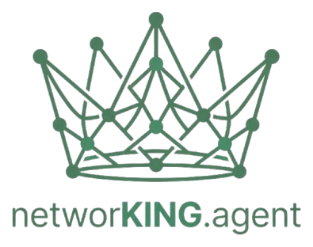

<p align="center">
  
</p>

<p align="center">
  <a href="LICENSE"></a>
  <a href="https://frontend-psi-seven-fptzxsze1f.vercel.app"></a>
  
  
  
</p>

# networKING.agent

**A multi-agent AI system that researches a person before you message them,
so the message is specific instead of "loved your profile!". You still read,
edit, and personally send every single one.**

**[Live demo](https://frontend-psi-seven-fptzxsze1f.vercel.app)** — needs your
own free Gemini API key to actually run anything (get one from
[Google AI Studio](https://aistudio.google.com/apikey), see "Running it
locally" below).

I'm Rishindra, an MS Computer Science student at Wright State University,
building AI/ML systems (most recently as an AI Engineer Intern at ZUZU.AI,
working on RAG pipelines and FastAPI backends). This is a personal project
born out of a very unglamorous problem: doing real, well-researched
networking outreach on LinkedIn takes real time per person. I wanted an
agent system that does the *research* well, so the time I spend is on
judgment (who to reach out to, what to actually say, whether to hit send),
not on re-reading the same profile five times to find something honest to
say.

**If you got a LinkedIn message from me and ended up here out of curiosity:
hi.** That message was real, I wrote it, read it over, and sent it myself.
This project is just the thing that helped me get there. There's no LinkedIn
bot, no bulk blasting, no API hook into LinkedIn's messaging at all. It reads
a profile, does the research I'd otherwise do by hand, and drafts a few
message options into my own dashboard for me to pick from, edit, and send
myself.

## Who this is for

Anyone doing LinkedIn networking outreach seriously enough that generic
"great profile!" messages feel embarrassing to send, but who doesn't have
the time to deep-research every single person by hand: job seekers,
founders fundraising or recruiting, and students trying to break into a
field where a cold, well-researched message is the whole strategy.

**Not a fit if**: you want a tool that sends messages automatically or at
volume. This deliberately has no LinkedIn API integration and no send
button that touches LinkedIn directly, every message is drafted, then
copy-pasted and sent by a human, by design.

## Trust and safety, before you look at anything else

- No LinkedIn bot and no bulk messaging. There is no code path anywhere in
  this repo that sends a LinkedIn message; drafts land in a dashboard for
  a human to read, edit, and paste in themselves.
- JWT signing secrets and the API-key encryption key are generated fresh
  per install ([config.py](backend/config.py)) and never hardcoded or
  committed to source.
- Gemini API keys you add are encrypted at rest with Fernet/AES
  ([crypto.py](backend/crypto.py)), not stored as plaintext.
- Your resume, tone examples, and everything else you feed the TwinAgent
  profile is scoped per-account and never shared across users.

## What it actually does

1. You drop in a LinkedIn profile (PDF export, or pasted details) for
   someone you're curious about reaching out to.
2. A pipeline of Gemini-backed agents reads the profile and works out
   useful context: what they actually work on, what their company is
   like, what kind of ask (if any) would be appropriate for their
   seniority, and what's genuinely worth mentioning.
3. It drafts several message options, tuned so a VP's inbox gets treated
   differently from a recruiter's, and none of them are allowed to use
   AI-cliché phrases like "hope this finds you well" or "quick chat".
4. Everything lands in a Kanban board (Pending → Draft Ready → Sent →
   Replied → Closed) so you can track a real pipeline instead of losing
   track of who you talked to. Re-uploading the same person later
   refreshes their profile instead of creating a duplicate card.
5. You review, personalize further if needed, and send it yourself, from
   your own LinkedIn account, like a person.

## How it's built, and why

| Piece | What it does | Why this shape |
|---|---|---|
| **5-stage agent pipeline** ([generator.py](backend/generator.py)) | Profile Intelligence → Company Intelligence → Relationship Strategy → Personalization → Context Synthesis, then a Message Writing agent | Separate agents with separate responsibilities, so the model writing the message works from a structured brief instead of guessing everything at once |
| **QueueOrchestrator** ([orchestrator.py](backend/orchestrator.py)) | Dynamically sized pool of async background workers, one per active Gemini key, pulling from a pending queue | Handles rate-limit cooldown and automatic failover to standby keys without dropping a task, and scales with however many keys you've added |
| **Duplicate detection** ([main.py](backend/main.py)) | Re-uploading a profile matches by normalized LinkedIn slug, then email, then name+company | A person you added months ago gets their profile refreshed (company, title, experience) in place, not duplicated, and their existing status/history/drafts are left untouched if they've already been contacted |
| **Structural PDF parsing** ([parser.py](backend/parser.py)) | Heuristics anchored on document structure (the Summary/Experience heading), not fixed line positions | LinkedIn's PDF export sidebar length varies a lot between profiles; anchoring on a heading that's always present is more reliable than counting lines from the top |
| **Security by default** | Per-install generated JWT/encryption secrets, Fernet-encrypted API keys at rest | Nothing sensitive ships in this repo, and a fresh clone is safe to deploy without editing a secret out of source first |

## Tech stack

| Layer | Tech |
|---|---|
| Backend | FastAPI, SQLAlchemy (SQLite locally, Postgres in production) |
| AI | Google Gemini (`google-genai`), 5-stage agent pipeline |
| Auth | JWT (`python-jose`), bcrypt password hashing |
| Security | Fernet (AES) encryption at rest for API keys, per-install generated secrets |
| Frontend | Next.js, React, Tailwind |
| Ops | Async task orchestration with key-pool failover, Telegram bot + Slack webhook notifications |

## Running it locally

```bash
python run.py
```

This bootstraps a virtualenv, installs backend + frontend dependencies, and
starts FastAPI on `:8000` and Next.js on `:3000`. On first run it
auto-generates the JWT/encryption secrets into a local `.env` file (see
[backend/.env.example](backend/.env.example)); nothing sensitive ships in
this repo.

You'll need your own Gemini API key (free tier from
[Google AI Studio](https://aistudio.google.com/apikey)), added from the
app's "API Key Workers" screen after you sign up.

Deploying this somewhere real (Render + Neon Postgres + Vercel, entirely
free, no card required): see [DEPLOY.md](DEPLOY.md).

## License

MIT, see [LICENSE](LICENSE). Use it, fork it, adapt it, attribution
appreciated but not required.

***

*This is a personal side project, not a product. Feedback and PRs welcome,
but expect it to keep evolving as I use it.*
